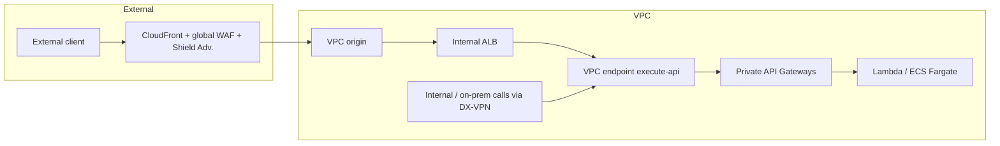

# Scenario 2: Public and private APIs

## 1. What weaknesses do you identify in the current architecture?

The first problem I see is that the internal APIs are exposed publicly by design, and this breaks the principle of least privilege on the network, every internal API becomes an attack surface that did not need to exist, route enumeration, credential stuffing on the authoriser, exploitation of a backend bug, all of that becomes reachable from outside for no reason.

Along with that, internal traffic does a hairpin through the internet, internal network goes out to the internet, enters CloudFront, passes through API Gateway and only then reaches the backend, so latency goes up, there is egress cost, internal integration ends up depending on the internet, and internal data crosses the public edge for no reason.

Bypassing CloudFront is also possible. The regional API Gateway endpoints are public, `{api-id}.execute-api.{region}.amazonaws.com`, confirmed in [API Gateway endpoint types](https://docs.aws.amazon.com/apigateway/latest/developerguide/api-gateway-api-endpoint-types.html), and anyone who finds that URL talks directly to API Gateway, skipping the global WAF, that web ACL with `CLOUDFRONT` scope that only applies to traffic passing through the distribution, and any edge logic that only exists on CloudFront, things like Lambda@Edge or geo restriction. The regional WAF that the design already associates with the API Gateways keeps applying even in this bypass, a regional association applies to any invocation of the stage regardless of where the traffic comes from, confirmed in [Associating or disassociating protection with an AWS resource](https://docs.aws.amazon.com/waf/latest/developerguide/web-acl-associating-aws-resource.html). What genuinely disappears is Shield Advanced coverage, API Gateway is not even on the list of resources it protects directly, confirmed in [Protected resources](https://docs.aws.amazon.com/waf/latest/developerguide/ddos-advanced-summary-protected-resources.html), so the only coverage today is the one on the CloudFront distribution, and it disappears entirely in this bypass. Restricting only by IP at the origin does not close this on its own either, the CloudFront origin-facing ranges are shared by any distribution from any customer, not just ours, so that only proves the traffic came from some CloudFront, not from our distribution.

The single endpoint also becomes a point of contention and a large blast radius. One domain only, one distribution only, for every team, so a WAF, DNS or certificate misconfiguration affects every API at once, paths can collide between different teams, and any change to the distribution needs central coordination. This also runs into a hard limit on cache behaviours per distribution.

There is also a noisy neighbour problem with throttling. The API Gateway request limit is per account and per region, AWS itself documents this, by default API Gateway limits the steady state requests per second across all APIs within an AWS account per Region, that is in [Throttle requests to your REST APIs](https://docs.aws.amazon.com/apigateway/latest/developerguide/api-gateway-request-throttling.html). So APIs from different teams sitting in the same account compete for the same ceiling unless we put limits per stage and per method using [usage plans](https://docs.aws.amazon.com/apigateway/latest/developerguide/api-gateway-api-usage-plans.html).

The Lambda authoriser is also a single point of authentication, if the caching of its result is not well configured it becomes a bottleneck and a cost, and if there is a bug in it, it compromises every API at once, this is described in [Use API Gateway Lambda authorizers](https://docs.aws.amazon.com/apigateway/latest/developerguide/apigateway-use-lambda-authorizer.html).

And lastly there is a lack of complementary controls for outside consumers, mTLS for partners, API keys and usage plans per client, observability per API with structured access logs by route and by team, none of that appears in the current design, even though all of it is a native API Gateway feature, [mutual TLS](https://docs.aws.amazon.com/apigateway/latest/developerguide/rest-api-mutual-tls.html), [usage plans and API keys](https://docs.aws.amazon.com/apigateway/latest/developerguide/api-gateway-api-usage-plans.html) and [access logging via CloudWatch](https://docs.aws.amazon.com/apigateway/latest/developerguide/set-up-logging.html).

## 2. What would the new architecture be, simple, efficient and with the smallest impact possible?

To serve private internal use and the mixed internal plus external case, I would use four native building blocks, private API Gateway endpoints, custom domain names for private APIs, DNS split horizon on Route 53 and CloudFront VPC origins for whatever needs to be exposed externally. No backend changes, what changes is just the endpoint type, the resource policy and the DNS.

Internal use APIs move to the `PRIVATE` endpoint type. The documentation defines this as a private API is a REST API that is only callable from within an Amazon VPC, and access happens through an interface VPC endpoint for `execute-api`, with a resource policy restricting by `aws:SourceVpce`, these are the conditions that the [Private REST APIs](https://docs.aws.amazon.com/apigateway/latest/developerguide/apigateway-private-apis.html) page itself recommends. The same page confirms that access from on-premises is possible, you can also use Direct Connect to establish a connection from an on-premises network to Amazon VPC and then access your private API over that connection, and for DNS resolution from the datacentre I would use [Route 53 Resolver inbound endpoints](https://docs.aws.amazon.com/Route53/latest/DeveloperGuide/resolver-forwarding-inbound-queries.html).

To give friendly names I would use [custom domain names for private APIs](https://docs.aws.amazon.com/apigateway/latest/developerguide/apigateway-private-custom-domains.html), which became generally available in [November 2024](https://aws.amazon.com/about-aws/whats-new/2024/11/amazon-api-gateway-custom-domain-name-private-rest-apis/), something like `api.internal.allianz-trade.com`, or even `api.allianz-trade.com` itself in a private hosted zone on Route 53, with an alias record pointing to the interface VPC endpoint, exactly as described in [Routing traffic to an Amazon VPC interface endpoint](https://docs.aws.amazon.com/Route53/latest/DeveloperGuide/routing-to-vpc-interface-endpoint.html). Consumption happens by creating a domain name access association between the VPC endpoint and the private domain, and that domain can be shared across accounts via AWS RAM, which already solves the scenario of multiple teams across multiple accounts.

The APIs that serve internal and external use at the same time also become private, just with two access paths. On the internal side it is the same private path I just described, VPC endpoint, without going through the internet. On the external side CloudFront remains the public front door, except now it reaches the private API using VPC origins, CloudFront reaches the VPC origin, which reaches an internal ALB, which reaches the `execute-api` VPC endpoint. This is the pattern AWS itself published in [Accessing private Amazon API Gateway endpoints through custom Amazon CloudFront distribution using VPC origins](https://aws.amazon.com/blogs/compute/accessing-private-amazon-api-gateway-endpoints-through-custom-amazon-cloudfront-distribution-using-vpc-origins).

To close it off, I use DNS split horizon, the public zone `api.allianz-trade.com` points to CloudFront, and a [private hosted zone](https://docs.aws.amazon.com/Route53/latest/DeveloperGuide/hosted-zones-private.html) with the same name points, via alias, to the VPC endpoint. The consumer does not need to change anything, the same URL resolves to the right path depending on where the call is coming from.

The reason I consider this the smallest impact is that the domain stays the same, the paths stay the same, the backends and the authoriser stay the same, internal clients just start resolving the DNS into the VPC. And there is a rather important side effect here, since no public API Gateway endpoint is left standing, the bypass problem genuinely stops existing, it is not just mitigated.

## 3. How could CloudFront be configured to route traffic to multiple API Gateways based on the path?

This is the native cache behaviours with path patterns mechanism, it is the pattern the community uses for "one domain, N APIs".

**1. Register each API Gateway as an origin of the distribution.** The domain is `{api-id}.execute-api.{region}.amazonaws.com` and the origin path is `/{stage}`, for example `/prod`. The origin path is a documented CloudFront field, it appends that directory to the domain before sending the request to the origin, that is in [Origin settings](https://docs.aws.amazon.com/AmazonCloudFront/latest/DeveloperGuide/DownloadDistValuesOrigin.html), and AWS itself has a whole article about this exact scenario of several APIs behind a single distribution, mapping `/api1` to the stage of one REST API and `/api2` to the stage of another, in [Configure a custom domain for API Gateway APIs behind a CloudFront web distribution](https://repost.aws/knowledge-center/api-gateway-domain-cloudfront).

**2. Create one cache behaviour per path pattern.** In whatever precedence order makes sense, `/claims/*` points to the claims API origin, `/brokers/*` points to the brokers API origin, and so on, the default behaviour handles whatever is left over. It is the Name field of each origin that the cache behaviour uses to know where to route when the path pattern matches, confirmed on the same [Origin settings](https://docs.aws.amazon.com/AmazonCloudFront/latest/DeveloperGuide/DownloadDistValuesOrigin.html) page.

**3. Configure cache and origin request for these APIs.** I would use the managed cache policy `CachingDisabled`, described in [managed cache policies](https://docs.aws.amazon.com/AmazonCloudFront/latest/DeveloperGuide/using-managed-cache-policies.html), and the origin request policy `AllViewerExceptHostHeader`, which genuinely exists as a managed policy, with fixed ID `b689b0a8-53d0-40ab-baf2-68738e2966ac`. AWS itself describes this policy as intended for use with Amazon API Gateway, because these origins expect the Host header to contain the origin domain name, not the domain name of the CloudFront distribution, so forwarding the viewer's Host can stop API Gateway from working, all of this is in [managed origin request policies](https://docs.aws.amazon.com/AmazonCloudFront/latest/DeveloperGuide/using-managed-origin-request-policies.html).

**4. Keep an eye on the limits.** The default is 75 cache behaviours and 100 origins per distribution, both adjustable by requesting a quota increase, that is in [CloudFront quotas](https://docs.aws.amazon.com/AmazonCloudFront/latest/DeveloperGuide/cloudfront-limits.html). If it is necessary to go beyond that, or if the routing genuinely needs to be dynamic, the way is to use Lambda@Edge on the origin request event rewriting the origin on every request, this is a use case with an official example of dynamic, content based origin selection in [Lambda@Edge example functions](https://docs.aws.amazon.com/AmazonCloudFront/latest/DeveloperGuide/lambda-examples.html).

## 4. How to protect the regional API Gateway endpoints against traffic that bypasses CloudFront and the WAF?

As long as the regional endpoints remain public, the solution documented by AWS itself and the one the community uses most is a secret origin custom header combined with a regional WAF and rotation via Secrets Manager.

CloudFront injects a secret header, for example `x-origin-verify`, into every request it sends to the origin. This is what AWS calls an origin custom header, and CloudFront's own documentation describes the technique, by configuring your origin to respond to requests only when they include a custom header that gets added by CloudFront, you prevent users from bypassing CloudFront and accessing your content directly on the origin, that is in [Add custom headers to origin requests](https://docs.aws.amazon.com/AmazonCloudFront/latest/DeveloperGuide/add-origin-custom-headers.html). The part about the value genuinely being a secret, with that exact name, `X-Origin-Verify`, comes from [How to enhance Amazon CloudFront origin security with AWS WAF and AWS Secrets Manager](https://aws.amazon.com/blogs/security/how-to-enhance-amazon-cloudfront-origin-security-with-aws-waf-and-aws-secrets-manager/), CloudFront adds the custom header, X-Origin-Verify, with the value of the secret from Secrets Manager, and forwards the request to the origin.

The regional WAF associated with the API Gateways, following [associating protection with an AWS resource](https://docs.aws.amazon.com/waf/latest/developerguide/web-acl-associating-aws-resource.html), has a rule that blocks any request that does not come with that header at the correct value. Anyone calling `execute-api` directly does not know the secret and gets a 403. And it genuinely has to be in the WAF, because the [API Gateway resource policy](https://docs.aws.amazon.com/apigateway/latest/developerguide/apigateway-resource-policies.html) authorises by AWS account, by source IP range, by VPC or VPC endpoint, it does not evaluate a header value.

The secret itself is kept in Secrets Manager with automatic rotation, the rotation function updates the value in both CloudFront and the WAF on every cycle. AWS itself published the reference solution for this in [How to enhance Amazon CloudFront origin security with AWS WAF and AWS Secrets Manager](https://aws.amazon.com/blogs/security/how-to-enhance-amazon-cloudfront-origin-security-with-aws-waf-and-aws-secrets-manager/), with the code in the [aws-samples/amazon-cloudfront-waf-secretsmanager](https://github.com/aws-samples/amazon-cloudfront-waf-secretsmanager) repository.

As an extra layer I would still keep an IP set on the regional WAF with the CloudFront origin-facing ranges, coming from the official `ip-ranges.json`, documented in [Locations and IP address ranges of CloudFront edge servers](https://docs.aws.amazon.com/AmazonCloudFront/latest/DeveloperGuide/LocationsOfEdgeServers.html). The way to do it here is the IP set on the WAF, or even `aws:SourceIp` directly on the API Gateway resource policy, a condition key confirmed in [AWS condition keys for API Gateway resource policies](https://docs.aws.amazon.com/apigateway/latest/developerguide/apigateway-resource-policies-aws-condition-keys.html), except that second option is not the best one here, the resource policy has an 8192 character limit, and AWS itself recommends using the WAF instead of it precisely when the policy has many IPs, confirmed in [Quotas for configuring and running a REST API in API Gateway](https://docs.aws.amazon.com/apigateway/latest/developerguide/api-gateway-execution-service-limits-table.html). I would never use this on its own, since those IPs are shared by any CloudFront distribution from any customer, so filtering by IP only proves the call came from some CloudFront, not from my distribution, and anyone can create their own distribution pointing at my `execute-api`. This is why CloudFront's own documentation on protecting an origin does not even mention IP filtering, it goes straight to the secret header, confirmed in [Restrict access to files on custom origins](https://docs.aws.amazon.com/AmazonCloudFront/latest/DeveloperGuide/private-content-overview.html#forward-custom-headers-restrict-access).

But the solution I would genuinely recommend as the target is making these endpoints private and exposing them via CloudFront VPC origins, the way I described in question 2. Then there is no public endpoint left to bypass, and the VPC origin guarantees the origin is only reachable through CloudFront, that is in [Restrict access with VPC origins](https://docs.aws.amazon.com/AmazonCloudFront/latest/DeveloperGuide/private-content-vpc-origins.html).
