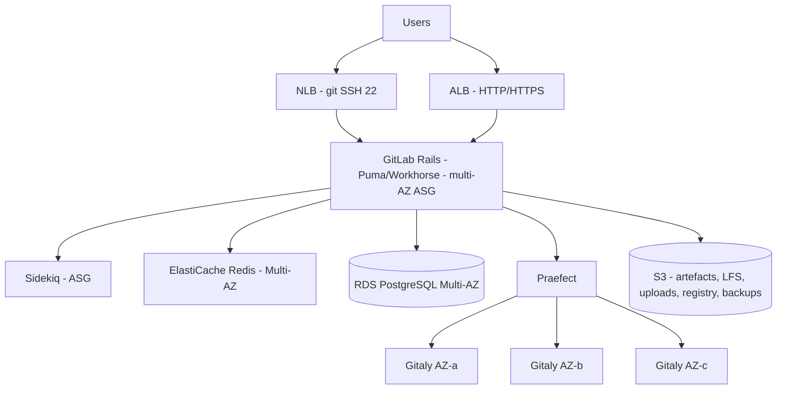

# Scenario 3: GitLab resilience and monitoring

## 1. What are the weaknesses of the current GitLab architecture from a resilience point of view?

The biggest weakness is that the single EC2 instance is a single point of failure for everything that is not the database. Rails, Sidekiq, Gitaly with the repositories, Redis and the container registry all run on the same host, so an instance failure, an AZ issue or a simple maintenance window means total service unavailability.

EBS makes this worse because it is a single AZ resource, the root and the projects and artefacts volumes are stuck in the instance's AZ, and recovering in another AZ depends on a snapshot, with high RTO and RPO if there is no automation ready for that.

There is also no load balancer or Auto Scaling, nothing replaces the instance automatically when it goes down, the only scaling available is vertical, and every resize, patch or upgrade means downtime.

The state is all coupled to local disk, CI artefacts, LFS, uploads and the registry live on EBS instead of object storage, which stops horizontal scaling and makes any recovery more expensive.

And Multi-AZ RDS ends up being the only resilient component in the design, except that does not help much with everything else on a single host, on top of there being no mention of a tested backup strategy or DR in another region.

## 2. What target architecture do you suggest to improve resilience?

I would follow the [official GitLab reference architectures](https://docs.gitlab.com/administration/reference_architectures/), which is the community standard. The documentation itself says for environments serving 3,000 or more users, we generally recommend using an HA strategy, and for smaller sizes it says a backup strategy is sufficient and even preferable, so the real first decision is size, the smallest tier with HA is the 60 RPS or 3,000 user one.

The stateless layer, Rails and Sidekiq, goes into multi-AZ Auto Scaling Groups behind an ALB for HTTP and HTTPS and an NLB for git over SSH on port 22.

Git repositories go into a [Gitaly Cluster with Praefect](https://docs.gitlab.com/administration/gitaly/praefect/), three nodes across distinct AZs, and Praefect needs its own PostgreSQL, which can be a small RDS instance. The critical point here is not using EFS or NFS for the repository, the current documentation is direct, NFS cannot be used for repository storage, and about EFS it says GitLab strongly recommends against using cloud-based file systems such as AWS Elastic File System, because workloads like git, with many small files written in a serialised manner, do not get on well with these file systems, that is in [Using NFS with GitLab](https://docs.gitlab.com/administration/nfs/). It is worth noting that GitLab is developing a Raft-based replacement for Praefect, which removes Praefect and its database, but that is still an [epic in development](https://gitlab.com/groups/gitlab-org/-/epics/8903), so today the supported path remains Praefect.

Redis comes off the host and goes into Multi-AZ ElastiCache, Multi-AZ PostgreSQL RDS stays as it is, and all the file state, artefacts, LFS, uploads, registry and backups, goes into S3 via [object storage](https://docs.gitlab.com/administration/object_storage/), taking that weight off EBS.

For the backup itself, the Gitaly Cluster changes the answer on EBS that I would give in a simpler scenario. The documentation is direct, Gitaly Cluster (Praefect) does not support snapshot backups, disk snapshots are only supported for standalone Gitaly nodes, because a disk snapshot ends up logically inconsistent with what the application expects, GitLab has several subsystems with their own buffers and queues, and a snapshot catches this at different moments on each node, which breaks the metadata that Praefect keeps in sync with disk, that is in [Back up GitLab](https://docs.gitlab.com/administration/backup_restore/backup_gitlab/). So for the Gitaly Cluster the only valid backup is genuinely `gitlab-backup`, which knows how to handle the cluster topology. For a large repository in a cluster, the right way is to turn on server-side backup, with `REPOSITORIES_SERVER_SIDE=true`, where each Gitaly node streams its own backup straight to object storage without funnelling everything through Rails, cutting down network traffic, and it also keeps the incremental backup separately in object storage, that is on the same [Back up GitLab](https://docs.gitlab.com/administration/backup_restore/backup_gitlab/) page. That backup destination bucket is a dedicated S3 bucket for this, different from the object storage bucket where artefacts, LFS and uploads already live all the time. AWS Backup only comes in for RDS, with a retention policy and Vault Lock on top of RDS's own native backup. Regional DR relies on cross region replication configured on that backup bucket, replicating both the full backup and the incrementals. CI runners sit in a separate ASG or EKS, never on the GitLab host.

The official provisioning for this architecture is the [GitLab Environment Toolkit](https://gitlab.com/gitlab-org/gitlab-environment-toolkit), maintained by GitLab itself and described as a set of opinionated Terraform and Ansible scripts to assist with deploying scaled GitLab environments following the Reference Architectures. The [Installing GitLab on AWS](https://docs.gitlab.com/install/aws/) guide today is just a proof of concept walkthrough, it warns itself that it does not result in a highly available configuration and tells you to follow the reference architectures for production, which reinforces that this is genuinely the architecture to pursue here, not a shortcut for a small project. For even larger scales there is the Cloud Native Hybrid variant on EKS, with the documented caveat that it does not support zero downtime upgrades.

## 3. What monitoring practices would you implement in GitLab to avoid unavailability and service degradation, and to be alerted as quickly as possible when problems occur?

I would start with what GitLab already ships ready to use, the Linux package comes with Prometheus enabled by default, the documentation itself says Prometheus services are on by default, with genuine exporters for node, postgres, redis, pgbouncer, registry and a dedicated GitLab exporter, plus Gitaly, Sidekiq and Puma exposing metrics natively without a separate exporter (via `prometheus_listen_addr`, `sidekiq['metrics_enabled']` and `puma['exporter_enabled']`), all of that is in [GitLab Prometheus monitoring](https://docs.gitlab.com/administration/monitoring/prometheus/). I would collect this with Amazon Managed Service for Prometheus and visualise it in Amazon Managed Grafana, making use of the community's ready-made dashboards.

For health checking I would use the native endpoints, with one important detail, the right endpoint for the load balancer is `/-/readiness`, the documentation says the readiness probe checks whether the GitLab instance is ready to accept traffic via Rails Controllers, whereas `/-/health` only confirms the process is up without validating the database or any dependent services, and `/-/liveness` is there to detect deadlocks, all of this in [Health check endpoints](https://docs.gitlab.com/administration/monitoring/health_check/). GitLab's own zero downtime upgrade documentation requires the load balancer's health check to be against readiness.

To see what the user sees I would put in synthetic monitoring with [CloudWatch Synthetics canaries](https://docs.aws.amazon.com/AmazonCloudWatch/latest/monitoring/CloudWatch_Synthetics_Canaries.html) exercising the critical flows at short intervals, logging into the UI, `git ls-remote` or a shallow clone over HTTPS and SSH, an API call, this is what catches degradation before the user complains.

On infrastructure signals, alarms for CPU, memory and disk via the CloudWatch Agent, EBS IOPS, throughput and queue depth, Gitaly disk space, 5xx and p99 latency on the ALB, growing Sidekiq queue, connections and lag on RDS with [Performance Insights](https://docs.aws.amazon.com/AmazonRDS/latest/UserGuide/USER_PerfInsights.html), CPU and memory on ElastiCache.

Centralised logs in CloudWatch Logs, production_json.log, api_json.log, gitaly and sidekiq, with metric filters for error rates. And the alert needs to be actionable, composite CloudWatch Alarms to cut down noise, going to SNS and from there to Slack or PagerDuty, with EventBridge for infrastructure events such as AWS Health, autoscaling and RDS failover. To track application errors, Sentry can be plugged straight into the UI with [GitLab's native error tracking](https://docs.gitlab.com/operations/error_tracking/).

## 4. How would you automate the GitLab runbook (upgrades, configuration, and so on)?

Everything becomes code first, infrastructure in Terraform and `gitlab.rb` configuration in Ansible, which is exactly the GitLab Environment Toolkit model I mentioned in question 2, with secrets in Secrets Manager or SSM Parameter Store, never in the repository.

The execution engine for the runbooks is AWS Systems Manager, [SSM Automation](https://docs.aws.amazon.com/systems-manager/latest/userguide/systems-manager-automation.html) for operational procedures, upgrade, controlled restart, failover, backup restore, certificate rotation, with manual approval built in whenever it makes sense, using the [`aws:approve`](https://docs.aws.amazon.com/systems-manager/latest/userguide/automation-action-approve.html) action, which pauses the automation until designated approvers approve it via an SNS topic, with a configurable timeout of up to 30 days. Patch Manager with Maintenance Windows takes care of OS patching, and State Manager comes in for what AWS itself describes as reduce configuration drift, keeping the configuration in the state we define, that is in [AWS Systems Manager State Manager](https://docs.aws.amazon.com/systems-manager/latest/userguide/systems-manager-state.html).

GitLab upgrades follow a process, never manual SSH. First the [official upgrade path](https://docs.gitlab.com/update/upgrade_paths/), because you cannot skip mandatory stops, always applying to staging first. In the HA environment [zero downtime upgrades](https://docs.gitlab.com/update/zero_downtime/) can be used, which the documentation makes conditional on requires a multi-node GitLab environment built with the Linux package that has load balancing and available HA mechanisms configured, moving up minor by minor. For the stateless layer the AWS pattern is an immutable AMI built with Packer plus instance refresh on the ASG.

Automated and tested backup, `gitlab-backup` scheduled to S3 as the method that genuinely covers the Gitaly Cluster (EBS snapshot is not a supported option there, as I explained in question 2), with AWS Backup taking care of RDS, and restore tested periodically through a runbook in a DR game day, a backup that has never been restored is not a backup.

And the pipeline is the interface for all of this, the runbooks triggered by GitLab's own pipelines or ChatOps, with an audit trail of who ran what.
